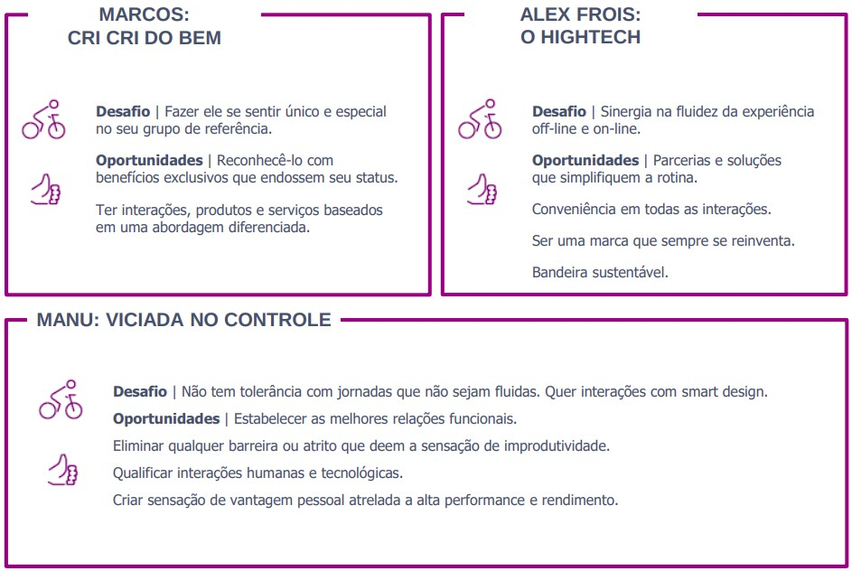
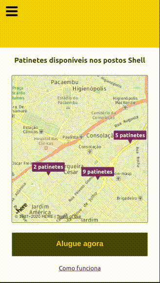

# Talent Fest - Raízen

O Talent Fest é um Hackathon de 2 dias organizado pela Laboratória. 

*** 

## O desafio

O desafio da Raízen é facilitar e melhorar a fluidez na rotina de movimento das pessoas e proporcionar a oferta de produtos que atendam suas necessidades, além do veículo.

A empresa apresentou 3 personas que gostariam de atingir:  

  

***

## A solução

Desenvolvemos uma _feature_ para integrar ao Shell Box que diversifica os serviços oferecidos pelo app, proporcionando uma nova forma de mobilidade mais sustentável.

Nossa solução foi focar na integração com empresas que oferecem serviços de aluguel de patinetes. O diferencial é que os postos que utilizam Shell Box terão uma estação de carregamento solar, reduzindo, assim, de 50% a 95% os gastos com energia elétrica

***

## Como funciona

 
